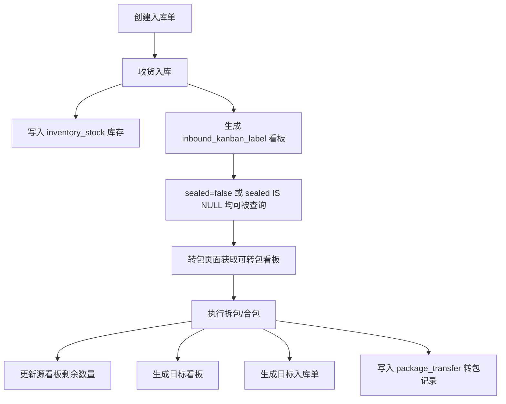

# 入库后看板库存转包链路联通修复 - 代码设计文档

## 一、任务背景

本次问题来自实际运行验证：用户完成入库后，在转包页面看不到可转包看板，库存和看板链路不直观，导致“根本无法创建转包”。继续执行接口验证后，又发现转包保存时数据库字段结构和字段长度不匹配，导致转包创建失败。

本次修复目标是让完整业务链路真正可用：

1. 创建入库单。
2. 完成收货入库。
3. 库存表增加现有库存。
4. 入库看板生成并在转包列表可见。
5. 执行转包后生成目标看板、目标入库单和转包记录。

## 二、问题根因

### 1. 入库看板存在，但转包列表查不到

`inbound_kanban_label` 表中的旧数据 `sealed` 字段为 `NULL`。原查询方法使用 Spring Data JPA 派生条件 `SealedFalse`，实际只匹配 `sealed = false`，不会匹配 `sealed IS NULL`。

因此，已经收货并生成的看板虽然存在，但转包页面调用 `/api/transfer/kanbans` 时被过滤掉了。

### 2. 新生成看板没有明确写入 sealed=false

入库生成看板、转包生成目标看板时，没有强制设置 `sealed=false`。这会让不同数据来源下的封存状态不一致，后续查询容易再次出现“数据存在但页面看不到”的问题。

### 3. 本地 MySQL 旧表结构没有跟上代码

`package_transfer` 表在早期已经创建过，后续 `schema.sql` 里的 `CREATE TABLE IF NOT EXISTS` 不会给旧表补字段。本地执行转包时，代码要写入：

- `source_outbound_doc_no`
- `target_inbound_doc_no`
- `transfer_type`

但旧表中没有这些字段，所以保存转包记录时报错。

### 4. 转包记录中的看板号字段长度不足

入库看板号是较长的业务编码，例如：

`R-2026-06-29-IN20260629230348593007-MAT-ENG-001-1-1`

原 `package_transfer.source_kanban_no` 和 `target_kanban_no` 长度为 `VARCHAR(50)`，真实看板号超过 50 字符，导致插入时报 `Data too long for column 'source_kanban_no'`。

## 三、设计方案

### 1. 兼容旧数据：NULL 也视为未封存

将转包可选看板查询从派生方法改为 JPQL，统一判断：

```sql
sealed = false OR sealed IS NULL
```

这样旧数据和新数据都能被正确查询。

### 2. 新数据显式写入 sealed=false

在以下场景中显式设置未封存：

- 入库单生成待入库看板。
- 收货入库时生成已入库看板。
- 转包生成目标看板。

这样后续数据状态更稳定，不依赖数据库默认值或 Java 对象默认值。

### 3. 补充旧库兼容 SQL

在 `schema.sql` 中追加 `ALTER TABLE`，用于补齐旧表字段，并调整看板号字段长度。

本项目当前配置了 `spring.sql.init.continue-on-error=true`，所以对于已经有字段的新库，重复执行 `ADD COLUMN` 报错不会阻断启动；对于旧库，则能自动补字段。

### 4. 看板号字段扩容到 100

统一将 `package_transfer` 中源看板号和目标看板号字段调整为 `VARCHAR(100)`，与业务看板号长度匹配。

## 四、涉及文件

| 文件 | 作用 |
| --- | --- |
| `backend/src/main/java/com/example/wms/entity/InboundKanbanLabel.java` | 给看板实体的 `sealed` 设置默认值 `false` |
| `backend/src/main/java/com/example/wms/repository/InboundKanbanLabelRepository.java` | 修复转包可选看板查询，兼容 `sealed IS NULL` |
| `backend/src/main/java/com/example/wms/service/impl/InboundOrderServiceImpl.java` | 入库生成看板时显式设置未封存 |
| `backend/src/main/java/com/example/wms/service/impl/TransferServiceImpl.java` | 转包生成目标看板时显式设置未封存 |
| `backend/src/main/java/com/example/wms/entity/PackageTransfer.java` | 转包记录看板号字段长度调整为 100 |
| `backend/src/main/resources/schema.sql` | MySQL 建表和旧库迁移脚本调整 |
| `backend/src/test/resources/schema-h2.sql` | 测试库表结构同步调整 |

## 五、修复后的业务流程



## 六、对用户的影响

修复后，用户不需要额外初始化看板。只要完成入库收货，系统会自动生成库存和入库看板。转包页面应该能看到可转包看板，并能执行转包。

也就是说，正确链路不是“先手动创建看板”，而是：

1. 先创建入库单。
2. 对入库单执行收货。
3. 系统自动生成库存和看板。
4. 到转包页面选择源看板执行转包。

